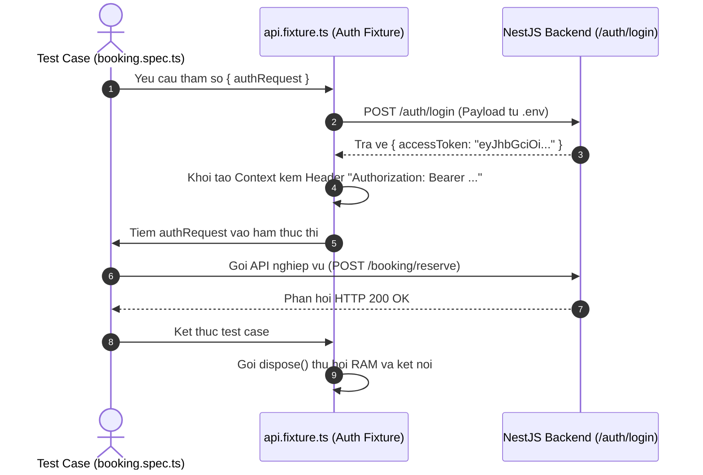

# Playwright Custom API Fixtures

## TL;DR

File `fixtures/api.fixture.ts` hiện thực hóa mẫu thiết kế Custom Test Fixtures trong Playwright Test Runner. Cơ chế này đóng vai trò như một hệ thống Dependency Injection tự động: thực hiện đăng nhập ngầm, trích xuất Access Token, khởi tạo Request Context kèm Authorization Header và tự động giải phóng tài nguyên sau khi test case hoàn tất.

---

## Core Problem and Motivation

Trong hệ thống Backend `ticket-booking`, hầu hết các endpoint nhạy cảm (như đặt giữ chỗ `/booking/reserve`, hủy vé, xem lịch sử giao dịch) đều yêu cầu Header `Authorization: Bearer <accessToken>`.

- **Khi không dùng Fixtures (Anti-pattern):** Mọi file test đều phải viết lặp lại logic đăng nhập, bóc tách JSON body và gán Header thủ công. Khi schema đăng nhập hoặc endpoint thay đổi, chi phí bảo trì tăng tuyến tính theo số lượng test case.
- **Khi dùng Custom Fixtures (SDET Standard):** Đóng gói toàn bộ vòng đời xác thực vào một Fixture dùng chung. Test case chỉ cần khai báo tham số `{ authRequest }` để nhận đối tượng Request Context đã được xác thực sẵn.

---

## Architectural Sequence Flow



---

## Code Comparison

### 1. Cách tiếp cận thủ công (Boilerplate)

```typescript
import { test, expect } from '@playwright/test';

test('TC06: Dat ve xem phim', async ({ request }) => {
  // Lap lai logic dang nhap o tung bai test
  const loginRes = await request.post('/auth/login', {
    data: { email: 'user@example.com', password: 'Password123!' },
  });
  const { accessToken } = await loginRes.json();

  // Gan Header thu cong
  const res = await request.post('/booking/reserve', {
    headers: { Authorization: `Bearer ${accessToken}` },
    data: { showId: 'show-123', seatIds: ['A1', 'A2'] },
  });
  expect(res.status()).toBe(200);
});
```

### 2. Cách tiếp cận qua Custom Fixture

```typescript
import { test, expect } from '../../fixtures/api.fixture.js';

test('TC06: Dat ve xem phim', async ({ authRequest }) => {
  // authRequest da chua san Bearer Token - Tap trung test logic nghiep vu
  const res = await authRequest.post('/booking/reserve', {
    data: { showId: 'show-123', seatIds: ['A1', 'A2'] },
  });
  expect(res.status()).toBe(200);
});
```

---

## Lifecycle Mechanics

Cơ chế thực thi của một Custom Fixture trong Playwright tuân theo 3 giai đoạn:

1. **Setup Phase:** Khởi tạo `APIRequestContext` độc lập và gửi request đăng nhập lấy JWT token.
2. **Execution Phase (`use`):** Bàn giao context kèm Header `Authorization` cho test function thực thi thông qua `await use(authContext)`.
3. **Teardown Phase:** Ngay sau khi test function kết thúc (pass hoặc fail), Playwright chạy tiếp các dòng code sau `use()` để gọi `dispose()`, dọn dẹp bộ nhớ và ngắt kết nối mạng.

---

## Team Responsibility and WBS Mapping

- **Phạm vi sử dụng:** Nền tảng dùng chung cho toàn bộ Phase 2 (API Automation Suite - Trọng số 30%).
- **Người chịu trách nhiệm chính (WBS 2.1):** Thành viên phụ trách Module Auth (Nguyễn Quốc Đương) hoàn thiện code gọi API đăng nhập chuẩn bên trong `fixtures/api.fixture.ts`.
- **Người tái sử dụng (WBS 2.2):** Thành viên phụ trách Module Booking Redlock (Trần Văn Ngọc) tái sử dụng `{ authRequest }` để viết các test case giữ ghế và chống Race Condition.
