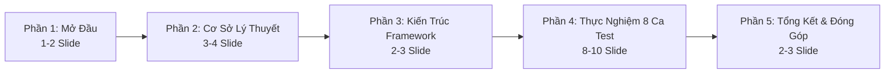

# Group Presentation Deck Structure and Guidelines

## TL;DR

Tài liệu này xác lập cấu trúc bộ Slide thuyết trình chính thức (`67_Slide.pptx`) cho Nhóm 67 (Đồ án Kiểm thử phần mềm với Playwright). Thay vì tạo các slide nháp riêng lẻ ở từng task gây phân mảnh và lệch thiết kế, toàn bộ 7 thành viên tập trung hoàn thiện mã nguồn và nội dung Báo cáo (Word/LaTeX). Việc tổng hợp và thiết kế bộ Slide hoàn chỉnh được thực hiện tập trung 1 lần duy nhất tại Phase 4 (WBS 4.2A và 4.2B).

---

## 5-Part Master Presentation Deck Structure

Bộ slide chính thức gồm khoảng 20 - 25 slide, tuân theo mạch kể chuyện kỹ thuật (Technical Storytelling) 5 phần:

### Phần 1: Mở Đầu và Đặt Vấn Đề (1 - 2 Slide)
- **Nội dung:** Giới thiệu nhóm 67, thông tin đề tài (Chủ đề C: Automation Testing với Playwright).
- **Trọng tâm:** Nêu bật tầm quan trọng của kiểm thử tự động hóa trong vòng đời phát triển phần mềm hiện đại và mục tiêu xây dựng khung kiểm thử kép (Dual-Engine Framework).

### Phần 2: Cơ Sở Lý Thuyết và Đối Sánh Công Cụ (3 - 4 Slide)
- **Nội dung:** 
  - 7 nguyên lý kiểm thử phần mềm cốt lõi áp dụng vào đồ án.
  - Phân tích kiến trúc Playwright (kết nối WebSocket qua Chrome DevTools Protocol).
  - Bảng đối sánh kỹ thuật và chi phí TCO: Playwright vs Selenium 4 vs Cypress vs TestComplete.

### Phần 3: Thiết Kế Kiến Trúc Framework và CI/CD Pipeline (2 - 3 Slide)
- **Nội dung:** *(Hạng mục phụ trách: Trần Văn Ngọc - WBS 1.6)*
  - **Mô hình Multi-Project:** Phân tách ranh giới độc lập giữa API Backend (`tests/api/`), Web UI (`tests/e2e/`) và Smoke Suite (`tests/smoke/`).
  - **Cơ chế Custom API Fixtures:** Hệ thống Dependency Injection tự động tiêm Token xác thực (`fixtures/api.fixture.ts`).
  - **Quy trình GitHub Actions CI:** 4 chốt chặn Quality Gates (Typecheck -> Lint -> Smoke Sanity -> Test Execution -> HTML Report).

### Phần 4: Thực Nghiệm và Kết Quả 8 Ca Kiểm Thử (8 - 10 Slide)
- **Tầng API Automation (4 Ca - NestJS Ticket Booking Backend):**
  - *Ca 1 (WBS 2.1 - Nguyễn Quốc Đương):* Auth Lifecycle, JWT & Token Rotation.
  - *Ca 2 (WBS 2.2 - Trần Văn Ngọc):* High-Contention Concurrency & Redis Redlock Race Condition.
  - *Ca 3 (WBS 2.3 - Đặng Duy Lam):* Booking Transaction & Idempotency Key.
  - *Ca 4 (WBS 2.4 - Nguyễn Hoài Linh):* RFC 9457 Problem Details & Rate Limiting.
- **Tầng Web UI Automation (4 Ca - SauceDemo Swag Labs):**
  - *Ca 1 (WBS 3.1 - Lê Minh Quân):* Full E2E Checkout Flow với Page Object Model.
  - *Ca 2 (WBS 3.2 - Ngô Gia Bảo):* Network Mocking `page.route()` HTTP 500 & Locked-out User.
  - *Ca 3 (WBS 3.3 - Lê Minh Tài):* Post-Mortem Diagnostics với Trace Viewer & Performance Glitch User.
  - *Ca 4 (WBS 3.4 - Lê Minh Tài):* Visual Regression Testing & Dynamic Data Masking.

### Phần 5: Tổng Kết, Demo và Đánh Giá Đóng Góp (2 - 3 Slide)
- **Nội dung:**
  - Báo cáo kết quả tổng hợp từ Playwright HTML Report và Trace Artifacts.
  - Bảng tổng kết phân công WBS và tỷ lệ đóng góp thực tế của 7 thành viên.
  - Kết luận và định hướng mở rộng (Load Testing với k6 / K8s Automation).

---

## Workflow Policy: Single Source of Truth

1. **Nguyên tắc thực thi:** Trong suốt Phase 1, 2 và 3, các thành viên không tự tạo slide lẻ. Nguồn sự thật duy nhất về nội dung nằm ở cuốn Báo cáo môn học (`67_Bao_cao.docx` / `67_Bao_cao.tex`).
2. **Phân công thiết kế Slide (Phase 4):**
   - **Nguyễn Quốc Đương (WBS 4.2A):** Chịu trách nhiệm thiết kế Master Layout, Phần 1, Phần 2 và Phần 3 (Slide 1 đến 12).
   - **Trần Văn Ngọc (WBS 4.2B):** Chịu trách nhiệm thiết kế Phần 4 và Phần 5 (Slide 13 đến 25).
3. **Quy chuẩn đồ họa:** 
   - Tối đa 1 font chữ tiêu đề và 1 font chữ nội dung chuẩn kỹ thuật.
   - Sử dụng ảnh chụp màn hình terminal/giao diện thực tế có độ phân giải cao.
   - Tuyệt đối không sử dụng icon/emoji trang trí thiếu chuyên nghiệp.
